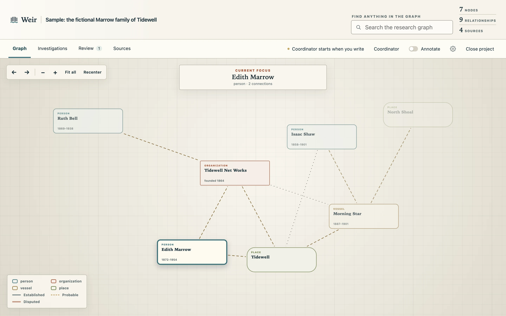
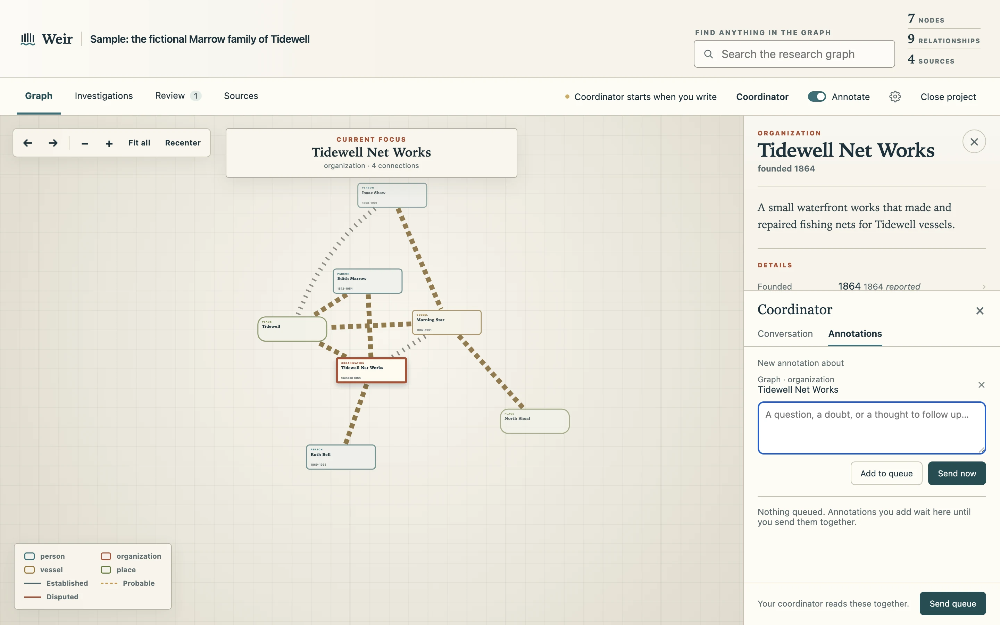

# Weir

Weir is a research workspace that builds evidence-backed graphs.
Give it questions, and a coordinator agent groups them into batches of research that other agents carry out.
When a batch is done, the coordinator assigns a writer agent to produce a research walkthrough: an account of the question, the path the research took, what it found, and where it is still uncertain, with each step tied to its evidence.
The batch's findings then become a proposed update to the graph, which you review and apply.

The graph is made of nodes and edges.
A node is any entity the research is about: a person, a patent, a shipwreck, a lawsuit, or even a rumor.
An edge is a relationship between two nodes.
Every node and edge traces back to the quotes and sources behind it.



*The graph of the fictional sample project.*

## Annotate the research itself

Weir reduces the gap between the research product and the research question.
Every part of the research can be annotated: a node, an edge, an empty field, a finding, a step of a walkthrough, a source, or any words you select in them.

An annotation is not a copy of the text.
It records what you marked as a research object, with its IDs: the words, the finding or walkthrough step or source they sit in, the batch it belongs to, and the screen you were on.
The coordinator looks up that exact record, with the evidence and sources behind it, and answers in the conversation with its plan.
It either adds your question to an open batch or starts a new one, and its researchers start from what you marked.
Where the evidence is thin, you ask for more right there.



*Annotating a node's details.*

## How the research is kept honest

- Each researcher is a Claude Code or Codex agent, sandboxed in its own folder.
- Every finding must quote a source and say where in the source the quote is.
  The app checks quotations against the preserved documents.
- Researchers can't change the graph.
  Only you do, when you apply a graph update.
- A node with little evidence says so.
  Its summary states only why it's on the graph, and empty fields show as gaps you can ask about.

## Run it

Weir runs on macOS.
It has not been tested on Linux, and Windows is not supported yet.

You need Git, Node.js 24 or later, and Claude Code or Codex installed.

```sh
git clone https://github.com/Dbutler2885/weir-research.git
cd weir-research
npm start
```

The first run installs what the app needs and opens a setup page in your browser.
There you connect your Claude or Codex account, then either say what you want to research or open the sample project.
After that, `npm start` reopens your last project, and **Close project** in the app takes you back to your list of projects.
Your research stays on your computer in `.research/`, outside version control.

The agents run on your own Claude or Codex account and count against its usage limits.
A batch can run several researchers at once, so heavy research uses your quota quickly.

## Why I built it

I built Weir to research local history, but it works for any subject where you want to know who and what was involved and how they connect.
The graph is one output of the research; other outputs can be built on the same findings.

## How it's built

- `src/`: the browser app in TypeScript, with the graph drawn by D3.
- `server/`: a local Node service that stores each project and supervises the agents.
- `server/agents/`: one supervisor with Claude and Codex adapters, and the sandbox settings in `isolation.mjs`.
- `skills/`: the instructions each agent role works from.

```sh
npm run check             # tests and build
npm run test:integration  # end-to-end checks with fake agents
```

The [guide](docs/guide.md) covers settings, sources, reading PDFs, and the workflow in detail.

## Contributing

Issues and pull requests are welcome.
Run `npm run check` before opening a pull request.

## License

Weir is open source under the [MIT license](LICENSE).
